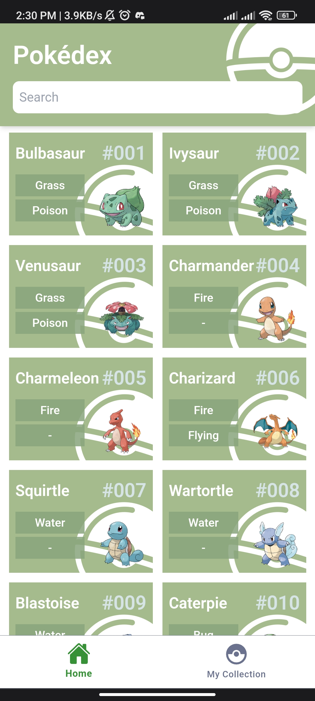
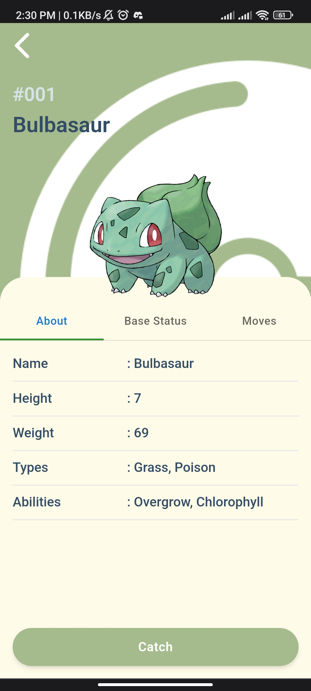
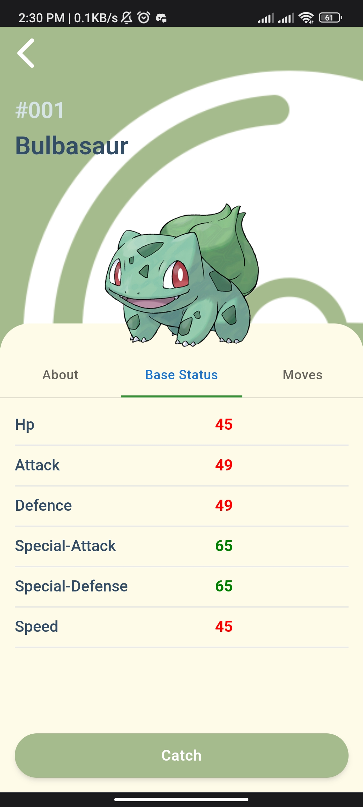
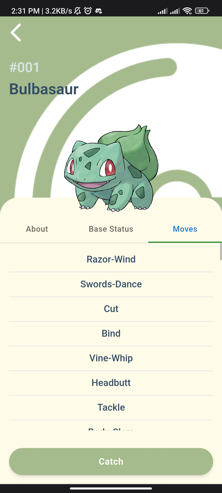
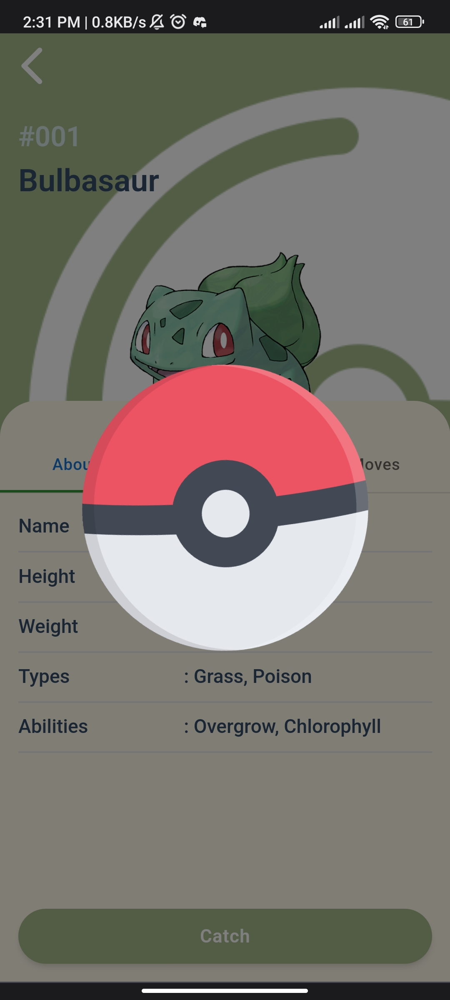
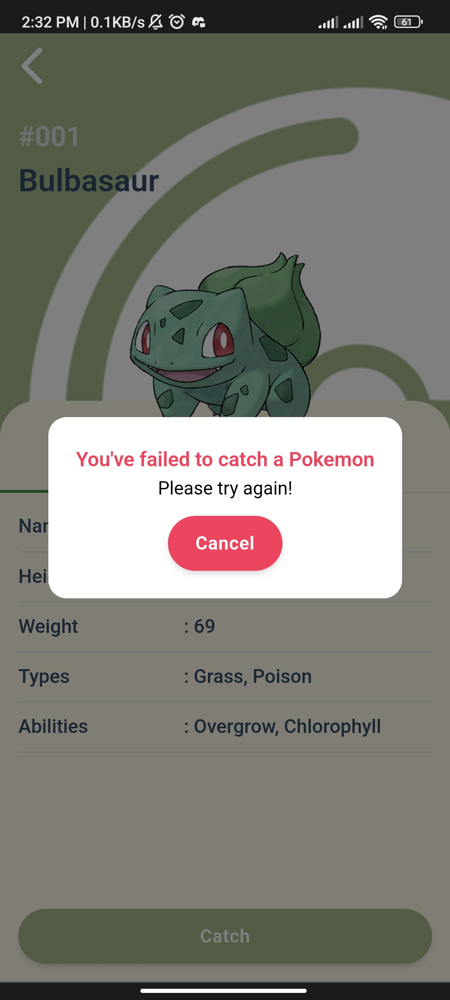
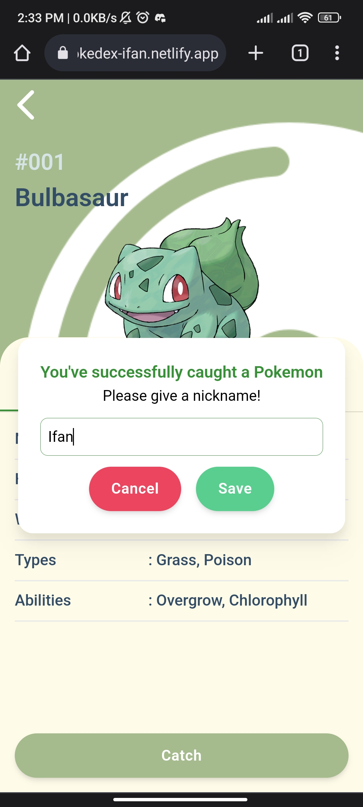
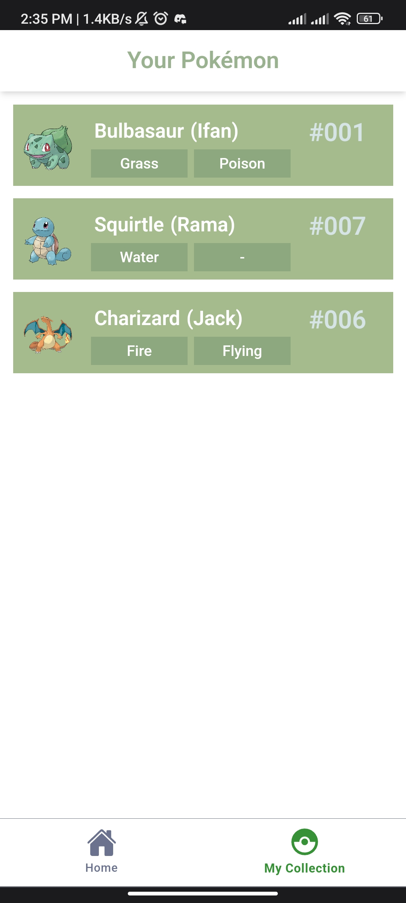
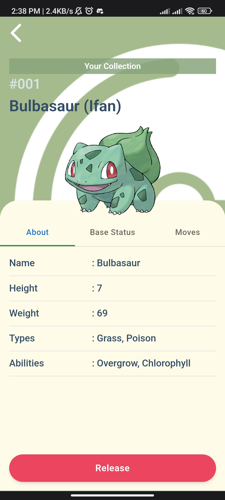
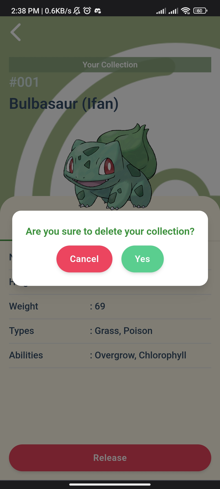

## Project Pokedex Ifan

Pokedex App (Ifan)

A mini app (mobile varsion) that showing pokemon at home page. you can see details or stats of pokemon. catching 
pokemon, and add the pokemon to your collection, give a nickname of your pokemon, and release your pokemon as well.

I made this app for a portfolio

## Project Screen Shot(s)

## Deployment

I deployed this app on Netlify
and here's the app domain where you can see the app in detail:

`https://pokedex-ifan.netlify.app/`
